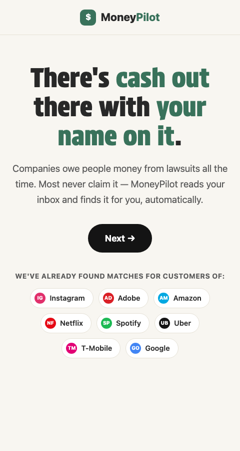
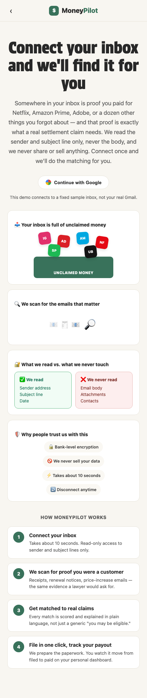
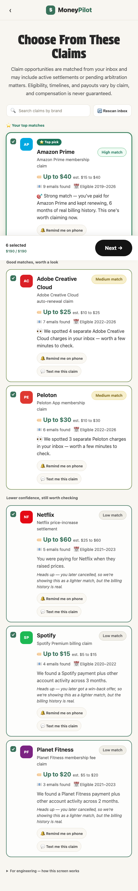
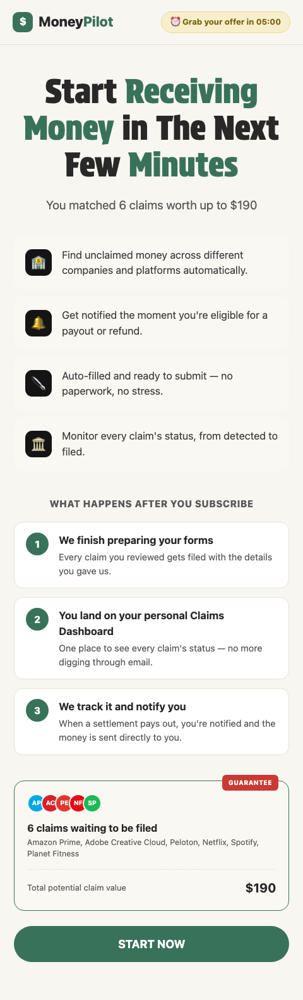
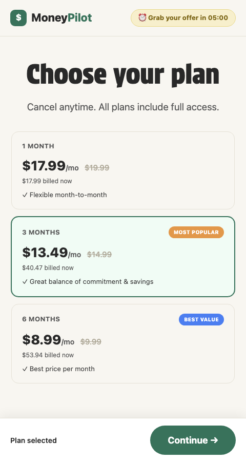
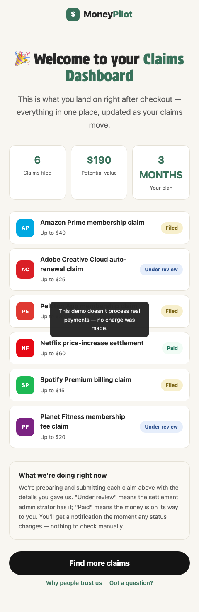

# MoneyPilot — Inbox-Based Claims Personalization

**A working prototype that replaces a generic eligibility quiz with a claims funnel personalized from a user's own inbox.**

| | |
|---|---|
| **Status** | Working prototype — full funnel clickable end to end |
| **Stack** | Vanilla HTML / CSS / JS, no build step, no backend |
| **Data layer** | `claims.json` + `mock_emails.json` (static files, live-editable) |
| **Screens** | 14, hash-routed, `index.html` → `flow.js` |

---

## 1. The problem

Class-action settlements and mass-arbitration claims pay out **billions of dollars a year**, and the large majority of it goes unclaimed. Two things drive that:

1. **People don't know they're eligible.** A settlement notice buried in a legal footer or a one-line email doesn't register as "this is money you're owed."
2. **The discovery mechanism is bad.** MoneyPilot's own existing product asks a 9-question yes/no quiz ("Have you ever had an Instagram account?") to guess at eligibility — slow, generic, and only as good as what the user remembers and bothers to answer honestly.

Meanwhile, the actual proof of eligibility — *you were a paying customer during the settlement window* — is usually already sitting in the user's inbox: receipts, renewal notices, price-increase emails, cancellation confirmations. Nobody was using that signal.

## 2. The solution

Read the inbox instead of asking a quiz. Specifically:

- Match each email's sender domain to a small table of known brands.
- Classify what kind of email it is (receipt, renewal, cancellation, etc.) from the **subject line only** — never the body, both for cost and for auditability.
- Score every brand's claim using a transparent, hand-weighted formula (not a black-box model) that rewards real billing history and discounts stale or negative signal.
- Show the result as a ranked feed with a plain-language reason for every card — never a bare percentage.
- Wrap that in the same funnel shape as MoneyPilot's real product (landing → connect → claims → checkout → dashboard), so the personalization engine sits inside a realistic, sellable product experience rather than a bare internal tool.

**Scope note:** this build reads a fixed 24-email mock inbox, not a live, authenticated one. That's deliberate — it lets the matching/scoring logic itself get evaluated before the much larger, much more sensitive problem of real OAuth inbox access is taken on. See [§8](#8-out-of-scope--simulated).

---

## 3. Product flow

14 screens, hash-routed (`#/claims`, `#/offer`, etc.) so refresh/back/forward all work without a backend. Full rationale for hash routing vs. path routing is in-line in `flow.js`.

```
Landing (×3)  →  Connect inbox  →  Scanning…  →  Reveal ($X owed)
     →  Claims picker  →  Claimant details  →  Per-claim review (×N)
     →  Offer / paywall  →  Plan picker  →  Dashboard
     →  (Trust · FAQ — reachable from the dashboard, not forced steps)
```

| # | Route | Screen | What it does |
|---|---|---|---|
| 1–3 | `/`, `/2`, `/3` | Landing | Hook, problem/solution explainer, brand social-proof strip, "how it works" |
| 4 | `/connect` | Connect inbox | Replaces the real product's 9-question quiz. Styled "Continue with Google," 5 explainer visuals |
| 5 | `/scanning` | Scanning | Runs the real classifier/scoring against the mock inbox |
| 6 | `/reveal` | Reveal | "You might be owed up to $X" — X is the real computed total, not a fixed teaser number |
| 7 | `/claims` | Claims picker | Multi-select cards: tier pill, payout, "why this claim" reasoning, search, sticky selection total |
| 8 | `/details` | Claimant form | Name / address / email, reused across every selected claim |
| 9 | `/review` | Per-claim review | Looped mock "auto-filled form" preview, one per selected claim |
| 10 | `/offer` | Paywall | Countdown, feature list, "what happens after you subscribe," claims summary |
| 11 | `/plans` | Plan picker | 1 / 3 / 6-month pricing tiers |
| 12 | `/dashboard` | **Post-payment dashboard** | The literal answer to "what do I get after I pay" — claim list with status pills, value summary |
| 13–14 | `/trust`, `/faq` | Trust & FAQ | Guarantee, testimonials, FAQ accordion — linked from the dashboard |

### Screenshots

| Landing | Connect inbox |
|---|---|
|  |  |

| Claims picker | Offer / paywall |
|---|---|
|  |  |

| Plan picker | Post-payment dashboard |
|---|---|
|  |  |

*(Full-resolution versions of every screen are in `/screenshots`.)*

---

## 4. How the matching algorithm works

Source of truth: `algorithm_spec.md`. Summarized here; that file has the worked example and the exact keyword lists.

```
email → sender-domain match → keyword classifier → (LLM fallback if no match) → type
all typed emails per brand → scoring formula → ranked claim list
```

### 4.1 Sender matching

Case-insensitive, exact-or-subdomain match against each claim's `sender_domains`. An unrecognized domain is ignored entirely — a brand with zero matching emails never produces a recommendation.

### 4.2 Keyword classifier

Subject line only, case-insensitive substring match, checked **in this exact priority order** — first match wins:

| Order | Category | Weight | Example keywords |
|---|---|---|---|
| 1 | `cancellation` | −6 | "cancelled," "we're sorry you're leaving," "membership terminated" |
| 2 | `abandoned_cart` | −8 | "complete your purchase," "your cart is waiting" |
| 3 | `winback` | −4 | "we miss you," "come back and save" |
| 4 | `receipt` | +10 | "receipt," "payment confirmed," "your bill" |
| 5 | `renewal` | +9 | "renews on," "has renewed," "annual renewal" |
| 6 | `price_increase` | +7 | "price is changing," "new pricing" |
| 7 | `reminder` | +6 | "renews soon," "upcoming renewal" |
| 8 | `trial_reminder` | +3 | "trial ends," "free trial ends" |
| 9 | `welcome` | +4 | "welcome to," "start your trial" |
| 10 | `unsubscribe_marketing` | 0 | "you've unsubscribed" (never conflated with cancellation) |
| 11 | `promo` | +1 | "% off," "limited time" (fallback bucket) |
| — | `unclassified` | +1 | No keyword rule matched — stubbed fallback since no live LLM is wired in; shown at Low tier rather than hidden |

Order matters: a subject containing both "renewal" and "cancelled" always resolves as a cancellation, because that category is checked first.

### 4.3 Scoring formula

```
window_match(e)   = 1.0 if e.date is inside the claim's eligibility window, else 0.2
recency_weight(e) = max(0.5, 1 − months_since(e.date, today) / 48)

signal_score   = Σ  type_weight(e) × window_match(e) × recency_weight(e)   over all matched emails
duration_bonus = min(distinct months with a positive-weight email, 6) × 2
conflict_mult  = 0.5 if the single most-recent email is negative-weight, else 1.0

raw_score   = (signal_score + duration_bonus) × conflict_mult
final_score = clamp(raw_score, 0, 100)
```

| Tier | Range |
|---|---|
| **High** | ≥ 60 |
| **Medium** | 30–59 |
| **Low** | 1–29 |
| *(not shown)* | ≤ 0 or no matching emails |

`today` is the live current date (not a frozen date), so recency genuinely decays as the mock data ages — see [§6](#6-known-limitations) for why that mattered for this specific dataset.

### 4.4 "Why this claim" copy

Generated per claim from the same signal the score uses (matched types, duration, most recent email) — never from the numeric score, and never hardcoded per brand. Framed by tier so a High match reads like an invitation and a Low match stays honest about weak signal:

> 🎯 *Strong match — you were paying for Amazon Prime when they raised prices. This one's worth claiming now.*
> *We found a Spotify payment plus other account activity across 3 months.* — *Heads up — you later got a win-back offer, so we're showing this as a lighter match, but the billing history is real.*

---

## 5. Data model

### `claims.json` — one row per settlement claim

| Field | Type | Example |
|---|---|---|
| `claim_id` | string (unique) | `"netflix_price_increase_2023"` |
| `brand` | string | `"Netflix"` |
| `sender_domains` | string[] | `["netflix.com"]` |
| `title` | string | `"Netflix price-increase settlement"` |
| `estimated_payout` | string range | `"$25 to $60"` |
| `eligibility_window.start` / `.end` | ISO date | `"2021-01-01"` / `"2023-12-31"` |

6 claims ship today:

| Brand | Payout | Eligibility window |
|---|---|---|
| Netflix | $25–$60 | 2021 – 2023 |
| Spotify | $5–$15 | 2020 – 2022 |
| Peloton | $10–$30 | 2022 – 2026 |
| Amazon Prime | $15–$40 | 2019 – 2026 |
| Planet Fitness | $5–$20 | 2021 – 2023 |
| Adobe Creative Cloud | $10–$25 | 2022 – 2026 |

### `mock_emails.json` — the stand-in inbox

| Field | Type | Example |
|---|---|---|
| `id` | number | `1` |
| `brand` | string | `"Netflix"` |
| `type` | string | Original mock-data label — **not trusted directly**; the classifier re-derives type from `subject`, see §4.2 |
| `subject` | string | `"Your Netflix bill for January"` |
| `sender` | string | `"billing@netflix.com"` |
| `date` | ISO date | `"2022-02-15"` |
| `body` | string | Present in the JSON for narrative flavor; **never read by the classifier**, per the sender/subject-only design |

Started at 24 emails across 6 brands; extended with additional recent, in-window emails for Amazon Prime, Peloton, and Adobe Creative Cloud so the UI can demonstrate all three confidence tiers (see §6). Both files are read live — edit either one and refresh the page (or hit "Rescan inbox" on the claims screen) to see the change, no rebuild step.

---

## 6. Known limitations

Carried forward as documented limitations rather than silently fixed, per this project's own working convention:

- **Weights are an untested hypothesis**, not a calibrated model. There's no labeled ground truth yet for what actually correlates with real settlement eligibility.
- **`reminder` vs. `trial_reminder` collision risk.** Both categories use "expiring soon"-style language; the guard in §4.2 only catches the cases this mock dataset exercises, not every real-world phrasing.
- **The original 24-email dataset could never reach the High tier** under the exact formula above — recency floors at 0.5 for anything ~2 years old, and every original email predated "today." Confirmed with product, then the mock inbox was deliberately extended (not the formula) so all three tiers are visible in the UI. Full rationale is in the in-app dev-note on the claims screen.
- **No email body is read**, so exact amount paid and plan tier are approximated from a static payout range, not verified per user.
- **Duration tracking assumes a fully visible inbox history** — a partially synced real inbox would under-count `duration_months` without any warning surfaced to the user.

---

## 7. Architecture

| File | Purpose |
|---|---|
| `app.js` | Pure engine: keyword classifier, scoring formula, reason-string generation, card-rendering primitive, JSON data loader. No screen/routing logic. |
| `flow.js` | Product layer: hash router, in-memory funnel state, all 14 screen renderers, countdown timer, plan picker, dashboard. |
| `index.html` | Thin shell — one `#app` mount point, loads `app.js` then `flow.js`. |
| `styles.css` | All visual styling, incl. brand color tokens and the confidence-pill system. |
| `claims.json` / `mock_emails.json` | The entire data layer — see §5. |
| `algorithm_spec.md` | Source of truth for the classifier/scoring formula — do not improvise variations without flagging the change. |
| `ui_spec.md` | Original claims-feed layout spec (card anatomy, pill states, brand tokens). |
| `screenshots/` | Reference screenshots used in this README. |

Engine (`app.js`) and product flow (`flow.js`) are deliberately split so the scoring logic can be tested in isolation (a Node harness extracts just the pure functions and re-runs the tier-spread check) independent of any UI change.

### Running locally

```bash
cd moneypilot
python3 -m http.server 8765
# open http://localhost:8765/index.html
```

A real HTTP server is required — `fetch()` of local JSON files is blocked under `file://` in most browsers.

---

## 8. Out of scope / simulated

Explicitly not real in this build, each flagged in-app rather than silently faked:

| Thing | What actually happens |
|---|---|
| Real inbox access | None. Runs entirely against `mock_emails.json`. "Continue with Google" uses the standard Google button branding but never shows a real or fake login form — it loads the mock dataset after a short delay. |
| LLM fallback classifier | Stubbed. Unclassified subjects are labeled `unclassified` and shown at Low tier rather than sent to a real model. |
| PDF claim filing | Cosmetic mock only, with fictional case numbers and a visible "not a real legal filing" watermark. |
| Payment processing | None anywhere in the plan picker — confirmed via an on-screen toast, no charge is ever made. |
| The `/dashboard` claim statuses | Illustrative (round-robin assigned), since there's no real filing pipeline to report actual status from. |

---

*Original MVP scope (classifier + single claims-feed screen) is preserved in `algorithm_spec.md` and `ui_spec.md`. This README documents the current state of the build, including the full funnel added afterward.*
